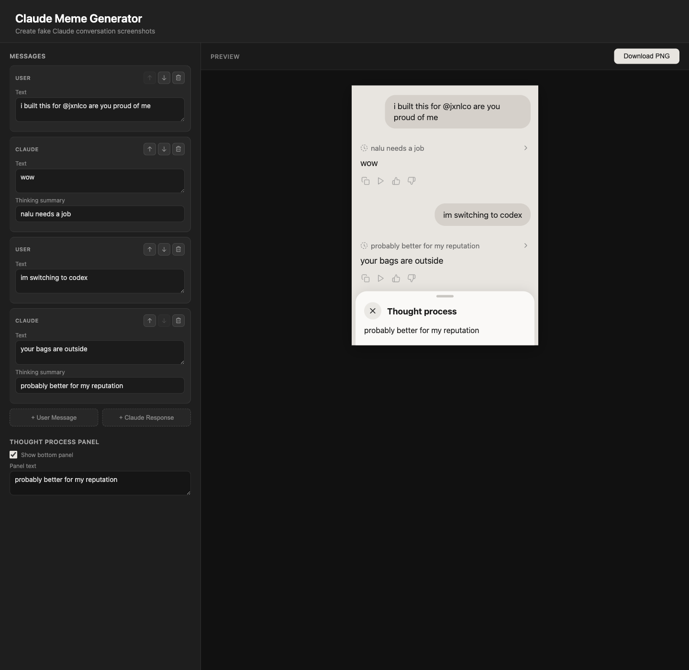

# Claude Meme Generator

Create fake Claude-style conversation screenshots, tweak the thought-process drawer, and export the result as a PNG.



## What It Does

This is a small React app for making polished joke screenshots that look like Claude conversations. You can edit each message, reorder the thread, add or remove assistant/user turns, customize the bottom panel, and download the final composition as an image.

It was inspired by [this tweet from @jxnlco](https://x.com/jxnlco/status/2035406849541861499).

## Features

- Edit both user messages and Claude responses
- Add assistant "thinking summary" rows
- Reorder or delete conversation turns
- Toggle and customize the bottom thought-process panel
- Export the preview as a high-resolution PNG

## Stack

- React 19
- Vite
- `html-to-image` for PNG export
- Phosphor icons

## Run Locally

```bash
npm install
npm run dev
```

Open the local URL printed by Vite, usually `http://localhost:5173`.

## Build

```bash
npm run build
npm run preview
```

## Notes

- This project is a parody/mockup generator for memes and screenshots.
- It is not affiliated with Anthropic or the Claude product team.
